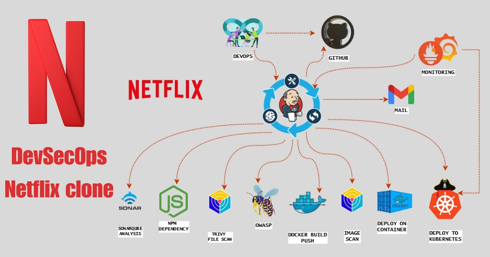

  

   
  

 

  
  
Home Page

# Deploy Netflix Clone on Cloud using Jenkins - DevSecOps Project!

### **Phase 1: Initial Setup and Deployment**

**Step 1: Launch EC2 (Ubuntu 22.04):**

- Provision an EC2 instance on AWS with Ubuntu 22.04.
- Connect to the instance using SSH.

**Step 3: Install Docker and Run the App Using a Container:**

**Step 4: Get the API Key:**

**Phase 2: Security**

1. **Install SonarQube and Trivy:**
    
        
2. **Integrate SonarQube and Configure:**
    - Integrate SonarQube with your CI/CD pipeline.
    - Configure SonarQube to analyze code for quality and security issues.

**Phase 3: CI/CD Setup**

1. **Install Jenkins for Automation:**
    
        
2. **Install Necessary Plugins in Jenkins:**

Goto Manage Jenkins →Plugins → Available Plugins →

Install below plugins

1 Eclipse Temurin Installer (Install without restart)

2 SonarQube Scanner (Install without restart)

3 NodeJs Plugin (Install Without restart)

4 Email Extension Plugin

### **Configure Java and Nodejs in Global Tool Configuration**

### SonarQube

**The Configure System option** is used in Jenkins to configure different server

**Global Tool Configuration** is used to configure different tools that we install using Plugins

1. **Configure CI/CD Pipeline in Jenkins:**
- Create a CI/CD pipeline in Jenkins to automate your application deployment.

**Install Dependency-Check and Docker Tools in Jenkins**

**Install Dependency-Check Plugin:**

**Configure Dependency-Check Tool:**

**Install Docker Tools and Docker Plugins:**

**Add DockerHub Credentials:**

**Phase 4: Monitoring**

1. **Install Prometheus and Grafana:**

   Set up Prometheus and Grafana to monitor your application.

  
2. **Configure Prometheus Plugin Integration:**

####Grafana

**Install Grafana on Ubuntu 22.04 and Set it up to Work with Prometheus**

**Step 1: Install Dependencies:**

**Step 2: Add the GPG Key:**

**Step 3: Add Grafana Repository:**

**Step 4: Update and Install Grafana:**

**Step 5: Enable and Start Grafana Service:**

**Step 6: Check Grafana Status:**

**Step 7: Access Grafana Web Interface:**

**Step 8: Change the Default Password:**

**Step 9: Add Prometheus Data Source:**

**Step 10: Import a Dashboard:**

2. **Configure Prometheus Plugin Integration:**
    - Integrate Jenkins with Prometheus to monitor the CI/CD pipeline.

**Phase 5: Notification**

1. **Implement Notification Services:**
    - Set up email notifications in Jenkins or other notification mechanisms.

# Phase 6: Kubernetes

## Create Kubernetes Cluster with Nodegroups

## Monitor Kubernetes with Prometheus

### Install Node Exporter using Helm

### Deploy Application with ArgoCD

1. **Install ArgoCD:**

2. **Set Your GitHub Repository as a Source:**

   
3. **Create an ArgoCD Application:**
 

4. **Access your Application**
   
**Phase 7: Cleanup**

1. **Cleanup AWS EC2 Instances:**
    - Terminate AWS EC2 instances that are no longer needed.

Referred from: https://github.com/N4si/DevSecOps-Project
